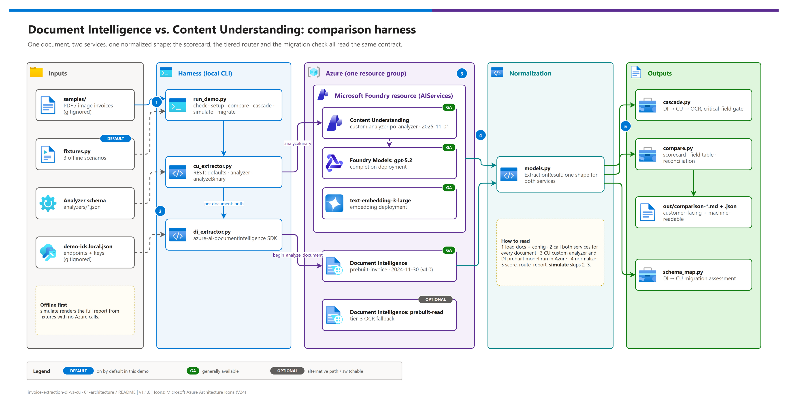
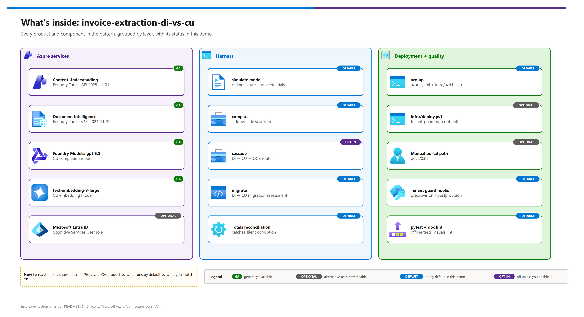
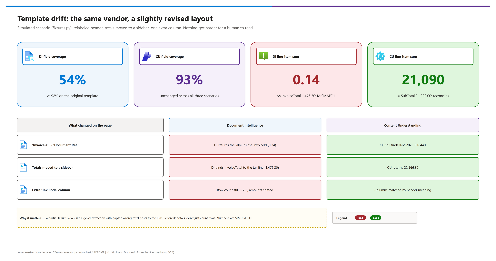

# Invoice extraction across changing layouts: Azure Document Intelligence vs. Content Understanding (invoice-extraction-di-vs-cu)

> Formerly published as `azure-di-vs-cu`. Old links redirect automatically.

<p>
&nbsp;
&nbsp;
&nbsp;
&nbsp;
&nbsp;

</p>

     

A working comparison harness that runs the **same document** through **Azure Document Intelligence** and **Azure Content Understanding** (both Foundry Tools), normalizes the two responses into one shape, and produces a side-by-side scorecard showing exactly where the services diverge. It is built for the recurring question: *"Document Intelligence works on our standard invoice formats, but accuracy collapses when vendors send different, or slightly changed, layouts. Should we move to Content Understanding?"* It answers that with your own documents instead of a slide, and runs fully offline (`simulate`) when no Azure resources exist yet.

## What this pattern delivers

[](./docs/assets/di-vs-cu-architecture.png)

<sub>Editable source: [`docs/assets/di-vs-cu-architecture.drawio`](./docs/assets/di-vs-cu-architecture.drawio) - regenerate with `python scripts/export_diagrams.py docs/assets`.</sub>

| | Capability | What you see |
|---|---|---|
|  | **Side-by-side extraction** | Same document, both services, a field-by-field table with confidence |
|  | **Template-drift failure** | The same vendor slightly revises a layout; DI degrades on the changed regions only |
|  | **Silent-corruption detection** | Totals reconciliation catches shifted-column errors that a row-count check passes |
|  | **The capability gap** | CU-only inferred fields (currency, document kind, risk summary) DI structurally cannot produce |
|  | **A tiered router** | DI → CU → OCR cascade with a configurable critical-field escalation gate |
|  | **Migration reality** | What ports 1:1 from DI to CU, and what needs a rewrite |
|  | **Offline mode** | The full comparison from fixtures: no Azure, no credentials, stamped `SIMULATED` |

> [!IMPORTANT]
> Nothing in this repo has been run against live Azure resources yet (badge: *static only*). The code paths follow the current GA REST/SDK contracts verified against Microsoft Learn on 2026-10-07; the sample numbers below come from `simulate`.

## What's inside

<table>
  <tr>
    <td align="center" width="25%"><br><b>Content Understanding</b><br><sub>Custom analyzer on a Microsoft Foundry resource, API 2025-11-01.</sub></td>
    <td align="center" width="25%"><br><b>Document Intelligence</b><br><sub>prebuilt-invoice + prebuilt-read, v4.0 (2024-11-30).</sub></td>
    <td align="center" width="25%"><br><b>Foundry Models</b><br><sub>gpt-5.2 + text-embedding-3-large for the CU analyzer.</sub></td>
    <td align="center" width="25%"><br><b>Python harness</b><br><sub>check · setup · compare · cascade · simulate · migrate.</sub></td>
  </tr>
</table>

[](./docs/assets/service-catalog.png)

<sub>Editable source: [`docs/assets/service-catalog.drawio`](./docs/assets/service-catalog.drawio).</sub>

## Quick start

| Step | | Action | Gate |
|---|---|---|---|
| **1** |  | `pip install -r requirements.txt` (Python 3.10+) | ☐ installs cleanly |
| **2** |  | `python src/run_demo.py simulate` | ☐ report in `out/`, stamped `SIMULATED` |
| **3** |  | Sign in **az and azd to the same tenant**, then `azd env new` + `azd env set AZURE_TENANT_ID / AZURE_SUBSCRIPTION_ID / AZURE_LOCATION` | ☐ `az account show` matches the target |
| **4** |  | `azd up` (preprovision hook refuses a mismatched tenant) | ☐ `demo-ids.local.json` written |
| **5** |  | `python src/run_demo.py setup` (CU defaults + analyzer) | ☐ analyzer created or reused |
| **6** |  | `python src/run_demo.py compare --input samples` | ☐ side-by-side report in `out/` |

<details><summary><b>Show the full command set</b></summary>

```bash
pip install -r requirements.txt
python src/run_demo.py simulate                 # offline, zero setup

# Live (after azd up or infra/deploy.ps1 or the manual path)
python src/run_demo.py check                    # verify configuration
python src/run_demo.py setup                    # CU defaults + analyzer
python src/run_demo.py compare --input samples  # side-by-side
python src/run_demo.py cascade --input samples  # tiered router
python src/run_demo.py migrate                  # DI -> CU assessment
```

</details>

> [!WARNING]
> Never run a bare `az login` / `azd up`. The active account drifts across tenants; [docs/03-deployment.md](./docs/03-deployment.md) starts with the tenant-explicit sign-in for both CLIs.

## The short version of the difference

**Document Intelligence extracts what it can locate on a page it recognizes. Content Understanding reasons about what the document means, against a schema you describe in plain language.**

| Criterion |  Document Intelligence |  Content Understanding |
|---|---|---|
| Approach | Trained extraction models (prebuilt or custom) | Schema-driven, LLM-backed analyzers (prebuilt or custom) |
| Field binding | Learned layout + label position | Meaning and context |
| Consistent layouts | **Excellent**: fastest, cheapest | Very good (you pay for reasoning you don't use) |
| Vendor revises the template | **Breaks on changed regions** | **Survives it** |
| New vendor layout | Degrades sharply (or label + retrain) | Usually no change |
| Confidence | On every located field | Opt-in, all field types, different calibration |
| Inferred values | None, located spans only | `generate` / `classify` fields |
| Content types | Documents, images | Documents, images, audio, video |
| Status |  v4.0 |  2025-11-01 ·  2026-06-01-preview |
| **Recommendation** | **The stable, high-volume core** | **The long tail and drift-prone vendors** |

Full treatment: [06 - Decision guide](./docs/06-di-vs-cu-decision-guide.md) · Use-case chart: [07 - Use-case comparison](./docs/07-use-case-comparison-chart.md)

## Sample output (simulated)

From `simulate`, **layout-drift** scenario: the *same vendor* relabeled a header, moved the totals into a sidebar and added a column.

[](./docs/assets/template-drift-infographic.png)

<sub>Editable source: [`docs/assets/template-drift-infographic.drawio`](./docs/assets/template-drift-infographic.drawio).</sub>

| Field | Document Intelligence | Conf | Content Understanding | Conf | Delta |
|---|---|:--:|---|:--:|---|
| `VendorName` | Contoso Industrial Supply | 0.94 | Contoso Industrial Supply | 0.95 | match |
| `CustomerName` | Northwind Manufacturing | 0.91 | Northwind Manufacturing | 0.94 | match |
| `PurchaseOrder` | — | — | PO-4482013 | 0.92 | **CU only** |
| `InvoiceId` | Document Ref. | 0.34 | INV-2026-118440 | 0.94 | **differs** |
| `SubTotal` | — | — | 21090.0 | 0.93 | **CU only** |
| `InvoiceTotal` | 1476.3 USD | 0.42 | 22566.3 | 0.95 | **differs** |

> [!NOTE]
> It's a partial failure, which is what makes it dangerous: vendor and customer still extract at 0.91+, but `InvoiceTotal` is the tax line and the line items are shifted a column. Row counts agree (3 vs 3); the **totals reconciliation** catches it: DI's line items sum to 0.14 vs 1,476.30 (**MISMATCH**), CU's sum to 21,090.00 = SubTotal (**reconciles**).

## Commands

| Command | Purpose | Needs Azure? |
|---|---|---|
| `check` | Verify config resolution, list input documents | No |
| `simulate` | Full comparison from fixtures | No |
| `migrate` | DI → CU migration assessment + `2025-11-01` analyzer schema generator | No |
| `setup` | Map CU model defaults, create the CU analyzer | Yes |
| `compare` | Run both services side by side | Yes |
| `cascade` | Tiered router (`--strategy cascade\|di-only\|cu-only`) | Yes |

## Documentation

| Doc | Contents |
|---|---|
| [01 - Architecture](./docs/01-architecture.md) | Layered view, the normalization layer, router, cost model, adapting to another document type |
| [02 - Prerequisites](./docs/02-prerequisites.md) | Subscription, RBAC, regions, model quota, local tools, pre-flight checklist |
| [03 - Deployment](./docs/03-deployment.md) | Fast path `azd up`, script path, analyzer setup |
| [03b - Manual deployment](./docs/03b-manual-deployment.md) | Portal-only path producing the same resources |
| [04 - Testing](./docs/04-testing.md) | Offline tests, live validation, the 20-minute demo script |
| [05 - Troubleshooting](./docs/05-troubleshooting.md) | Quick triage + per-service diagnosis |
| [06 - Decision guide](./docs/06-di-vs-cu-decision-guide.md) | **The customer-facing artifact** |
| [07 - Use-case chart](./docs/07-use-case-comparison-chart.md) | Use-case matrix, template drift, decision flow, cost and effort |
| [08 - Configuration reference](./docs/08-configuration-reference.md) | Every variable, output, key and recipe |

## The pattern worth stealing

`src/models.py` normalizes both services into one `ExtractionResult` shape. That single decision is the main architectural recommendation:

| Benefit | Why it matters |
|---|---|
| The comparison is **honest** | Neither service is penalized for envelope shape |
| The service becomes **swappable** | A stable contract sits between the vendor SDK and your ERP feed |
| A future DI ↔ CU move is **contained** | Not a rewrite of the downstream integration |

## Repo layout

| Path | Role |
|---|---|
| `src/` | Harness: `run_demo.py` CLI, extractors, `models.py`, `cascade.py`, `compare.py`, `schema_map.py`, `fixtures.py`, `config.py` |
| `analyzers/purchase-order-analyzer.json` | The CU field schema (`2025-11-01` shape): the actual IP |
| `infra/` | `main.bicep` (shared), `azd.bicep` + `azd.parameters.json`, `hooks/`, `deploy.ps1` |
| `docs/` | All narrative docs + `assets/` (draw.io sources, PNGs, icons, badges) |
| `scripts/` | `export_diagrams.py`, `lint_doc_visuals.py`, `make_badges.py` |
| `tests/` | Offline pytest suite: harness, reusability/publish-safety guards, configuration, doc visuals |
| `samples/` | Your synthetic documents (document files are gitignored) |
| `azure.yaml`, `demo-ids.template.json` | azd template; configuration template |

## Distribution

This repository is public. `.gitignore` excludes `demo-ids.local.json`, `.env*`, `.azure/`, `out/` (reports contain extracted content) and every document type under `samples/`. `demo-ids.template.json` is the committed shape of the configuration; the populated `demo-ids.local.json` is written by `azd up` / `infra/deploy.ps1` or by hand and **must never be committed**: it holds service keys.

> [!CAUTION]
> Never commit or record real customer documents. Use synthetic invoices that reproduce the same structural challenges (see `samples/README.md`), or `simulate`.

## Provenance

| Item | Source |
|---|---|
| CU API `2025-11-01` , `analyzeBinary`, `prebuilt-document` base + `models` block, resource defaults | [Migrate from Content Understanding preview to GA](https://learn.microsoft.com/azure/ai-services/content-understanding/how-to/migration-preview-to-ga), [Analyzer reference](https://learn.microsoft.com/azure/ai-services/content-understanding/concepts/analyzer-reference) |
| CU regions, supported models, preview features | [Region support](https://learn.microsoft.com/azure/ai-services/content-understanding/language-region-support), [Service limits](https://learn.microsoft.com/azure/ai-services/content-understanding/service-limits), [What's new](https://learn.microsoft.com/azure/ai-services/content-understanding/whats-new) |
| DI v4.0 `2024-11-30`, prebuilt-invoice fields | [DI what's new](https://learn.microsoft.com/azure/ai-services/document-intelligence/whats-new), [Invoice model](https://learn.microsoft.com/azure/ai-services/document-intelligence/prebuilt/invoice) |
| DI vs. CU positioning | [Choose the right Azure AI tool for document processing](https://learn.microsoft.com/azure/ai-services/content-understanding/choosing-right-ai-tool) |
| Model retirement dates | [Model retirement schedule](https://learn.microsoft.com/azure/foundry/openai/concepts/model-retirement-schedule) |
| Change history | [CHANGELOG.md](./CHANGELOG.md) |

*Last updated: 2026-10-07*
