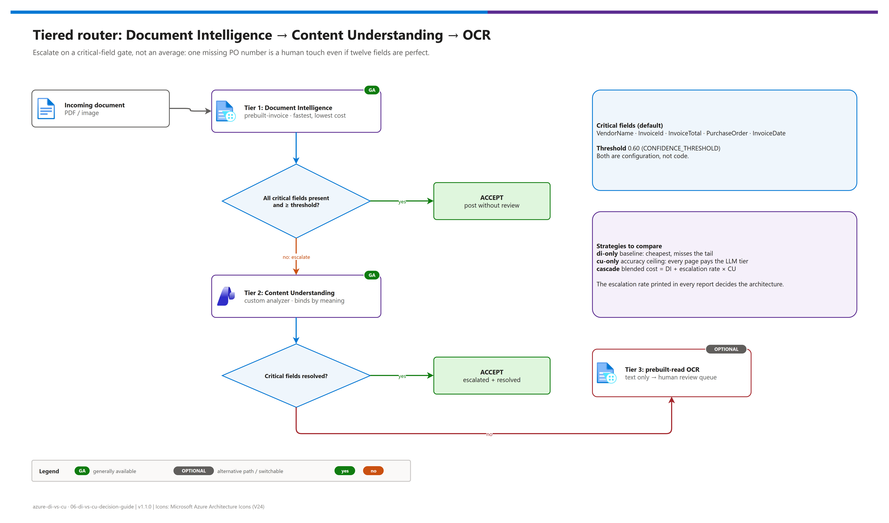

[README](../README.md) › 01 Architecture

# 01 - Architecture

<p>
&nbsp;
&nbsp;
&nbsp;
&nbsp;

</p>

   

How the comparison harness is put together: which Azure resources it calls, how both services' responses are projected into one normalized shape, how the tiered router decides when to escalate, and how to retarget the harness at another document type. It is for architects and developers who will run, extend, or lift patterns out of the harness. It is deliberately *not* a production pipeline: it is an evidence generator that turns "which service should we use?" into a table of numbers from your own documents.

## At a glance

| | Topic | One-line answer |
|---|---|---|
|  | Content Understanding | Custom analyzer `po-analyzer` on a Microsoft Foundry (AIServices) resource, REST API `2025-11-01` |
|  | Document Intelligence | `prebuilt-invoice` (and `prebuilt-read` for tier 3), v4.0 `2024-11-30`, Python SDK  |
|  | Models | CU custom analyzers need a completion (`gpt-5.2`) and an embedding (`text-embedding-3-large`) deployment |
|  | Load-bearing decision | One `ExtractionResult` shape for both services (`src/models.py`) |
|  | Router | Escalate on a critical-field gate, not on a mean confidence |
|  | Reuse | Retarget by configuration (`workload` block), not code |

## Layered architecture

[](./assets/di-vs-cu-architecture.png)

<sub>Editable source: [`assets/di-vs-cu-architecture.drawio`](./assets/di-vs-cu-architecture.drawio) - regenerate with `python scripts/export_diagrams.py docs/assets`.</sub>

| Tier | Component | Role |
|---|---|---|
| Inputs |  `samples/` | Your synthetic PDFs / images (document files are gitignored) |
| Inputs |  `src/fixtures.py` | Three offline scenarios that mirror real response shapes |
| Inputs |  `analyzers/purchase-order-analyzer.json` | The CU field schema: the actual IP |
| Inputs |  `demo-ids.local.json` | Endpoints, keys, model names (gitignored) |
| Harness |  `src/run_demo.py` | CLI: `check`, `setup`, `compare`, `cascade`, `simulate`, `migrate` |
| Harness |  `src/cu_extractor.py` | REST: `PATCH defaults`, `PUT analyzers/{id}`, `POST :analyzeBinary`, poll `Operation-Location` |
| Harness |  `src/di_extractor.py` | `azure-ai-documentintelligence` SDK, `begin_analyze_document` |
| Azure |  Microsoft Foundry resource | Hosts Content Understanding + the two model deployments |
| Azure |  Document Intelligence resource | `prebuilt-invoice`, `prebuilt-read` (optional: DI also runs on the Foundry resource) |
| Normalization |  `src/models.py` | `ExtractedField` / `ExtractionResult` / `CascadeResult` |
| Outputs |  `src/cascade.py`, `src/compare.py`, `src/schema_map.py` | Router, scorecard + reconciliation, migration assessment |
| Outputs |  `out/comparison-*.md` + `.json` | Customer-facing report + machine-readable sidecar (gitignored) |

### Request path

| Step | | What happens |
|---|---|---|
| **1** |  | `run_demo.py` resolves settings (env var → `demo-ids.local.json` → default) and collects documents |
| **2** |  | DI: `begin_analyze_document("prebuilt-invoice", bytes)` → `analyzeResult.documents[0].fields` |
| **3** |  | CU: `POST /contentunderstanding/analyzers/po-analyzer:analyzeBinary?api-version=2025-11-01` with the raw bytes → poll → `result.contents[0].fields` |
| **4** |  | Both payloads are projected into `ExtractionResult` |
| **5** |  | Scorecard, field table, totals reconciliation, router decision → `out/` |

> [!NOTE]
> In the GA API, `:analyze` accepts only JSON with an `inputs` array of **URLs**; local file bytes go to **`:analyzeBinary`**. Harnesses written against the preview APIs that posted bytes to `:analyze` fail against `2025-11-01`. See [Migrate from preview to GA](https://learn.microsoft.com/azure/ai-services/content-understanding/how-to/migration-preview-to-ga).

## The load-bearing design decision

**`src/models.py` is the most important file in this repo.** Both services return meaningfully different envelopes:

| Aspect | Document Intelligence | Content Understanding |
|---|---|---|
| Fields path | `analyzeResult.documents[0].fields` | `result.contents[0].fields` |
| Currency | `{"amount": 18450.0, "currencyCode": "USD"}` on each amount (no top-level currency field) | `18450.0` (plain number); currency is a separate `generate` field |
| Address | Structured object (street / city / postalCode) | Single formatted string |
| Confidence | On every located field | Only when `estimateFieldSourceAndConfidence` is on; then for extract, generate and classify fields |
| Client | `azure-ai-documentintelligence` SDK  with a poller | `azure-ai-contentunderstanding` SDK , or raw REST (used here for visibility) |

Both are projected into the same `ExtractionResult`. Two consequences:

1. **The comparison is honest.** Scoring the raw payloads would penalize each service for envelope shape rather than extraction quality.
2. **The service becomes swappable.** Everything downstream (the cascade, the report, and in production your ERP feed) depends on the normalized shape, not the vendor's response schema. A future DI ↔ CU move is a contained change.

> [!TIP]
> If a customer takes exactly one pattern from this demo, it should be this anti-corruption layer, not the service choice, which will keep changing.

## The tiered router

[](./assets/tiered-router-decision.png)

<sub>Editable source: [`assets/tiered-router-decision.drawio`](./assets/tiered-router-decision.drawio).</sub>

`src/cascade.py` runs the cheap tier first and escalates only on weak results. Escalation is decided by a **critical-field gate**, not a mean confidence: a document with twelve perfect fields and a missing PO number still needs a human touch, so it must escalate. The default gate is `VendorName, InvoiceId, InvoiceTotal, PurchaseOrder, InvoiceDate` at a 0.60 threshold, both configurable (`CRITICAL_FIELDS`, `CONFIDENCE_THRESHOLD`).

| Tier | Service | Accepts when | Otherwise |
|---|---|---|---|
| 1 | Document Intelligence `prebuilt-invoice` | All critical fields present and ≥ threshold, line items present | Escalate to tier 2 |
| 2 | Content Understanding custom analyzer | Same gate | Fall through to tier 3 |
| 3 | `prebuilt-read` OCR | Never "accepts": returns text for the human review queue | — |

## How this maps to a production pipeline

| Concern | In the demo | In production |
|---|---|---|
| Intake | Local `samples/` folder | Mailbox / supplier portal → storage → queue |
| Orchestration | Synchronous CLI loop | Queue-driven Functions or Logic Apps with retries, dead-lettering, idempotency |
| Identity | Account keys (setup speed) | Microsoft Entra ID + `Cognitive Services User`, `disableLocalAuth: true` |
| Normalization | `models.py` | Same contract, versioned |
| Low-confidence path | Report row | Human review queue |
| Downstream | Markdown + JSON | ERP-facing JSON / XML / spreadsheet |

> [!IMPORTANT]
> Keys are used for setup speed only. For anything beyond a demo, assign `Cognitive Services User` (the Bicep does this for `AZURE_PRINCIPAL_ID`), switch the clients to Entra ID, and set `DISABLE_LOCAL_AUTH=true`.

## Cost model

```
cost/document = DI_rate × pages
              + escalation_rate × (CU_extraction + CU_contextualization + model tokens) × pages
              + fallthrough_rate × OCR_rate × pages
```

**Escalation rate is the variable that decides the architecture**, and every report prints it. A low rate favors the cascade; a high rate means you pay twice on most pages and should go CU-only. Content Understanding bills content extraction and contextualization, and the generative model tokens are billed on your Foundry deployment ([pricing explainer](https://learn.microsoft.com/azure/ai-services/content-understanding/pricing-explainer)). Confirm current rates in the Azure pricing calculator before presenting numbers.

## Adapting this pattern to another document type

Retargeting the harness at another document type (receipts, purchase orders only, delivery notes, claims) is a **configuration change** for everything below. The `workload` block in `demo-ids.template.json` is the only document-type-specific surface:

| Setting | Default | Change it to |
|---|---|---|
| `workload.diModelId` (`DI_MODEL_ID`) | `prebuilt-invoice` | The DI prebuilt or custom model for the new type (e.g. `prebuilt-receipt`) |
| `workload.contentUnderstandingAnalyzerId` (`CU_ANALYZER_ID`) | `po-analyzer` | A neutral id for the new analyzer |
| `workload.cuAnalyzerSchema` (`CU_ANALYZER_SCHEMA`) | `analyzers/purchase-order-analyzer.json` | A new schema file: same `2025-11-01` shape, new fields + descriptions |
| `workload.criticalFields` (`CRITICAL_FIELDS`) | `VendorName, InvoiceId, InvoiceTotal, PurchaseOrder, InvoiceDate` | The fields whose absence forces a human touch for the new type |

What stays fixed: the normalization contract (`models.py`), the router logic, the report writer, the Bicep and hooks. `tests/test_reusability_guards.py::test_retarget_workload_by_configuration_only` proves a receipt workload resolves end to end without code edits.

> [!WARNING]
> The **side-by-side field table** still uses the invoice canonical field list in `di_extractor.DI_FIELD_MAP` and `cu_extractor.CU_FIELD_NAMES`. A new document type needs those two lists updated (and a scenario in `fixtures.py` if you want `simulate`). That is the one honest code touch-point; keep field names identical on both sides so rows line up.

---

Next: [02 - Prerequisites](./02-prerequisites.md) →

*Last updated: 2026-10-07*
