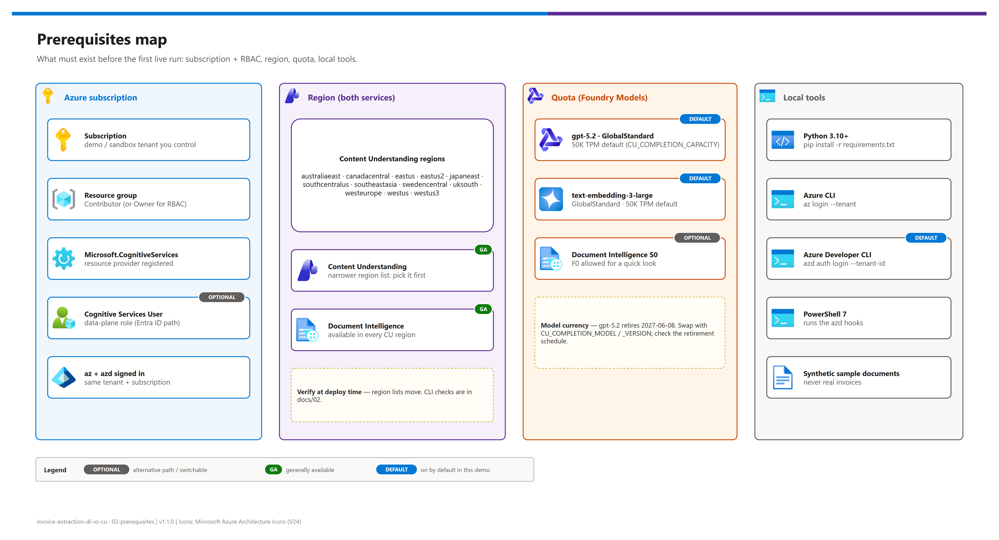

[README](../README.md) › 02 Prerequisites

# 02 - Prerequisites

<p>
&nbsp;
&nbsp;
&nbsp;
&nbsp;
&nbsp;

</p>

  

Everything that must be true before the first **live** run: the subscription and roles, a region that serves **both** services, model quota for the Content Understanding analyzer, and the local tools. It is for whoever deploys the demo. If you only want to show the comparison, you need none of this: `python src/run_demo.py simulate` runs offline with zero setup.

## At a glance

| | Topic | One-line answer |
|---|---|---|
|  | Subscription | A demo / sandbox subscription you control, never a corporate production tenant |
|  | Roles | Contributor on the resource group; Owner / User Access Administrator only if you want the RBAC assignment |
|  | Region | Must be a **Content Understanding** region (12 today); Document Intelligence is available in all of them |
|  | Quota | `gpt-5.2` + `text-embedding-3-large`, GlobalStandard, 50K TPM each by default |
|  | Tools | Python 3.10+, Azure CLI, Azure Developer CLI, PowerShell 7 |

## Prerequisites map

[](./assets/prerequisites-map.png)

<sub>Editable source: [`assets/prerequisites-map.drawio`](./assets/prerequisites-map.drawio).</sub>

## Azure subscription and RBAC

| Resource | Requirement | Why |
|---|---|---|
|  Subscription | Demo / sandbox; you know its tenant ID and subscription ID | The hooks refuse to run unless `az` is signed in to exactly this pair |
|  Resource group | **Contributor** (azd can create it: needs subscription-level Contributor) | Creates the Foundry and DI accounts + model deployments |
|  `Microsoft.CognitiveServices` provider | Registered | Both accounts are `Microsoft.CognitiveServices/accounts` (kinds `AIServices`, `FormRecognizer`) |
|  `Cognitive Services User` | Optional: needs Owner or User Access Administrator | Bicep assigns it to `AZURE_PRINCIPAL_ID` for the Entra ID path |
|  `listKeys` | Included in Contributor | The postprovision hook reads keys into the gitignored `demo-ids.local.json` |

> [!NOTE]
> Content Understanding lives on a **Microsoft Foundry resource** (ARM kind `AIServices`). A standalone Document Intelligence (`FormRecognizer`) resource does **not** expose Content Understanding, so existing DI users do not automatically have CU. Document Intelligence, however, also runs on the Foundry resource, which is why the dedicated DI resource is optional (`DEPLOY_DEDICATED_DOCUMENT_INTELLIGENCE=false`).

## Region alignment

Content Understanding has the narrower footprint, so pick its region first.

| Tier | Regions | Guidance |
|---|---|---|
| **Tier 1: strongly recommended** | `eastus2`, `swedencentral` | Typically first to receive new GPT-5-series models and capacity; this demo defaults to `eastus2` |
| **Tier 2: acceptable** | `eastus`, `westus`, `westus3`, `southcentralus`, `canadacentral`, `uksouth`, `westeurope`, `australiaeast`, `japaneast`, `southeastasia` | Supported CU regions; confirm `gpt-5.2` / `text-embedding-3-large` GlobalStandard quota before deploying |
| **Tier 3: workaround** | Any DI-only region | Keep DI where it is and deploy the Foundry resource in the nearest CU region; review data-residency implications first, or demo with `simulate` |

**Component availability matrix** (Microsoft Learn, verified **2026-10-07**; verify at deployment time):

| Component | Status | Availability |
|---|---|---|
|  Content Understanding, API `2025-11-01` |  | australiaeast · canadacentral · eastus · eastus2 · japaneast · southcentralus · southeastasia · swedencentral · uksouth · westeurope · westus · westus3 |
|  Content Understanding, API `2026-06-01-preview` |  | Same regions; no SLA. Not used by default |
|  Document Intelligence v4.0 `2024-11-30` |  | Broad; available in every CU region above |
|  `gpt-5.2` (2025-12-11) GlobalStandard |  | Region-dependent quota; retires **2027-06-08** |
|  `text-embedding-3-large` (1) GlobalStandard |  | Region-dependent quota; retires 2028-02-09 |

<details><summary><b>Verify at deployment time (CLI)</b></summary>

```powershell
# Is the AIServices kind offered in the region?
az cognitiveservices account list-skus --kind AIServices --location <REGION> -o table

# Which model versions/SKUs can the region deploy?
az cognitiveservices model list --location <REGION> `
  --query "[?model.name=='gpt-5.2' || model.name=='text-embedding-3-large'].{name:model.name, version:model.version, skus:join(',', model.skus[].name)}" -o table

# Current usage vs. quota in the region
az cognitiveservices usage list --location <REGION> -o table
```

Sources: [CU region support](https://learn.microsoft.com/azure/ai-services/content-understanding/language-region-support), [CU service limits / supported models](https://learn.microsoft.com/azure/ai-services/content-understanding/service-limits), [model retirement schedule](https://learn.microsoft.com/azure/foundry/openai/concepts/model-retirement-schedule).

</details>

> [!WARNING]
> Content Understanding's analyze operations accept a `processingLocation` parameter that **defaults to global**, and GlobalStandard model deployments can process data in any Azure geography. If your organization has data-residency requirements, review both before running real documents.

## Model quota and currency

| Product | Default | Change with |
|---|---|---|
|  Completion model | `gpt-5.2` version `2025-12-11`, GlobalStandard, 50K TPM | `CU_COMPLETION_MODEL`, `CU_COMPLETION_MODEL_VERSION`, `CU_COMPLETION_SKU`, `CU_COMPLETION_CAPACITY` |
|  Embedding model | `text-embedding-3-large` version `1`, GlobalStandard, 50K TPM | `CU_EMBEDDING_MODEL`, `CU_EMBEDDING_MODEL_VERSION`, `CU_EMBEDDING_SKU`, `CU_EMBEDDING_CAPACITY` |
|  Document Intelligence | `S0` (`F0` allowed for a quick look) | `DOCUMENT_INTELLIGENCE_SKU` |

> [!TIP]
> `gpt-5.2` is the completion model Microsoft Learn currently recommends for Content Understanding, and it retires on **2027-06-08**. Any model in the CU [supported-models list](https://learn.microsoft.com/azure/ai-services/content-understanding/service-limits) works (for example `gpt-5.4`, `gpt-5.4-mini`); change the four `CU_COMPLETION_*` values together and re-run `setup --recreate`.

## Local tooling

| Tool | Version | Check |
|---|---|---|
|  Python | 3.10+ | `python --version` |
|  Azure CLI | 2.60+ | `az version` |
|  Azure Developer CLI | 1.10+ | `azd version` |
|  PowerShell | 7.x (`pwsh`) | runs the azd hooks and `infra/deploy.ps1` |
|  draw.io desktop | optional | only to re-export diagrams (`scripts/export_diagrams.py`, `DRAWIO_EXE`) |

<details><summary><b>Python environment</b></summary>

```bash
python -m venv .venv
# Windows
.venv\Scripts\Activate.ps1
# macOS / Linux
source .venv/bin/activate

pip install -r requirements-dev.txt   # runtime deps + pytest
```

</details>

## Cost estimate

| Resource | Meter | Idle cost |
|---|---|---|
|  Document Intelligence S0 | Per page, by model (prebuilt-invoice vs. read) | None: pay per transaction |
|  Content Understanding | Content extraction (per page) + contextualization | None: pay per transaction |
|  gpt-5.2 / embeddings | Tokens consumed by the analyzer on your deployment | None for GlobalStandard |
|  Total for a demo | Tens of documents | Typically cents to a few dollars; verify in the pricing calculator |

## Sample documents and data handling

| Source | Allowed? | Notes |
|---|---|---|
|  Synthetic invoices you author (Word / Excel → PDF) | ✅ | Reproduce the *structural* challenges: revised template, unfamiliar structure, multi-page tables |
|  `simulate` fixtures | ✅ | Fictitious vendors (Contoso, Northwind, Fabrikam) |
|  Real invoices | ❌ in this repo | Only in your own tenant, never committed or recorded |

> [!CAUTION]
> Every document extension under `samples/` and the whole `out/` folder are gitignored because reports contain extracted content. Do not override that with `git add -f`.

## Pre-flight checklist

> [!IMPORTANT]
> Tick every box before the first live run. If any is unknown, stop and resolve it; never infer the tenant or subscription from whatever `az` is currently signed in to.

- [ ] Tenant ID and subscription ID of the **demo** subscription are known (not inferred from `az account show`)
- [ ] Region chosen from the Content Understanding list (Tier 1 or 2)
- [ ] `gpt-5.2` and `text-embedding-3-large` GlobalStandard quota available in that region
- [ ] Contributor on the subscription (or on an existing resource group passed as `AZURE_RESOURCE_GROUP`)
- [ ] Python 3.10+, Azure CLI, Azure Developer CLI, PowerShell 7 installed
- [ ] `python src/run_demo.py simulate` runs locally
- [ ] Synthetic sample documents ready in `samples/`

---

Next: [03 - Deployment](./03-deployment.md) →

*Last updated: 2026-10-07*
