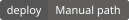
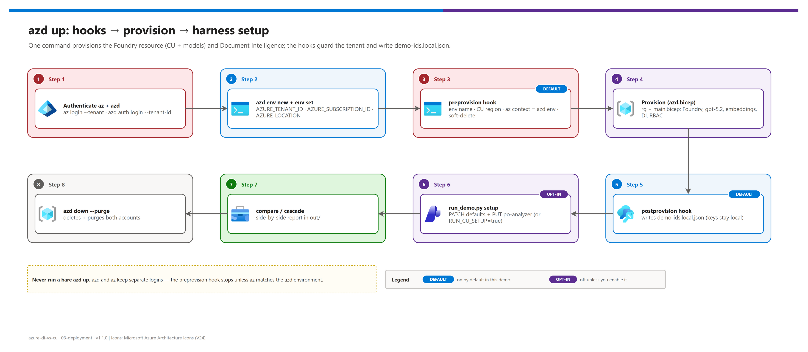

[README](../README.md) › 03 Deployment

# 03 - Deployment

<p>
&nbsp;
&nbsp;
&nbsp;
&nbsp;
&nbsp;

</p>

   

How to stand up the live side of the demo: one Microsoft Foundry resource (Content Understanding + the `gpt-5.2` and `text-embedding-3-large` deployments a GA custom analyzer needs), one Document Intelligence resource, and a gitignored `demo-ids.local.json` the harness reads. Three entry points produce the same resources from the same Bicep: **`azd up`** (fast path), **`infra/deploy.ps1`** (script path), and the **portal** ([03b - Manual deployment](./03b-manual-deployment.md)). Every path starts with tenant-explicit authentication.

## At a glance

| | Path | Use when | Time |
|---|---|---|---|
|  | **Fast path: `azd up`** | Default. One command, hooks guard the tenant and write the config | ~10 min |
|  | **Script path: `infra/deploy.ps1`** | No azd, or you want an explicit resource group / base name | ~10 min |
|  | **Manual: portal** ([03b](./03b-manual-deployment.md)) | IaC is blocked by policy, or a workshop where each resource is created visibly | ~25–35 min |

## Phase 0: Authenticate to the right tenant

> [!WARNING]
> The active `az` account silently drifts whenever any `az login` runs elsewhere, and **azd keeps a separate login from az**. Never run a bare `az login` / `azd up`. Resolve the tenant and subscription for *this demo* first; if you don't know them, ask, never guess.

```powershell
# 1. Sign both CLIs in to the intended tenant
az login --tenant <TENANT_ID>
az account set --subscription <SUBSCRIPTION_ID>
azd auth login --tenant-id <TENANT_ID>

# 2. Verify (must match before continuing)
az account show --query "{tenant:tenantId, subscription:id, subName:name, user:user.name}" -o table
```

- [ ] `az account show` shows the intended tenant **and** subscription
- [ ] `azd auth login` completed against the same tenant

## Fast path: azd up

[](./assets/azd-deployment-flow.png)

<sub>Editable source: [`assets/azd-deployment-flow.drawio`](./assets/azd-deployment-flow.drawio).</sub>

| Step | | Action | Gate |
|---|---|---|---|
| **1** |  | `azd env new dicu-demo` (3–12 chars, lowercase, starts with a letter) | ☐ environment created |
| **2** |  | `azd env set AZURE_TENANT_ID <TENANT_ID>` · `azd env set AZURE_SUBSCRIPTION_ID <SUBSCRIPTION_ID>` · `azd env set AZURE_LOCATION eastus2` | ☐ `azd env get-values` shows all three |
| **3** |  | `azd provision --preview`  | ☐ what-if lists the Foundry account, two deployments, DI account |
| **4** |  | `azd up` | ☐ hooks pass, `demo-ids.local.json` written |
| **5** |  | `python src/run_demo.py check` then `python src/run_demo.py setup` | ☐ `[OK]` on both services, analyzer created |

<details><summary><b>Optional azd settings before <code>azd up</code></b></summary>

```powershell
azd env set AZURE_RESOURCE_GROUP rg-existing            # reuse a resource group (default: rg-<env>)
azd env set DEPLOY_DEDICATED_DOCUMENT_INTELLIGENCE false # run DI on the Foundry resource instead
azd env set CU_COMPLETION_MODEL gpt-5.4                 # also set _VERSION and _DEPLOYMENT
azd env set CU_COMPLETION_MODEL_VERSION <version>
azd env set CU_COMPLETION_DEPLOYMENT gpt-5.4
azd env set RUN_CU_SETUP true                           # postprovision runs `run_demo.py setup`
azd env set WRITE_KEYS_TO_LOCAL_IDS false               # keep keys out of demo-ids.local.json
```

Every variable is listed in [08 - Configuration reference](./08-configuration-reference.md).

</details>

### What the hooks do

| Hook | Script | Does |
|---|---|---|
| `preprovision` | `infra/hooks/preprovision.ps1` | Validates `AZURE_ENV_NAME` (3–12 chars), `AZURE_LOCATION` is a CU region, allowed values for the switches; **stops unless `az account show` matches `AZURE_TENANT_ID` / `AZURE_SUBSCRIPTION_ID`**; lists soft-deleted accounts that would block the names |
| `postprovision` | `infra/hooks/postprovision.ps1` | Re-checks the tenant, writes `demo-ids.local.json` from the azd outputs (+ keys unless `WRITE_KEYS_TO_LOCAL_IDS=false`), optionally runs `run_demo.py setup` (`RUN_CU_SETUP=true`) |
| shared | `infra/hooks/common.ps1` | Same functions used by `infra/deploy.ps1`, so the azd and script paths can't drift |

> [!NOTE]
> `infra/azd.bicep` is subscription-scoped: it creates (or reuses) the resource group and calls the shared `infra/main.bicep` with every parameter. Resource names are `<env>-<5 chars>-foundry` and `<env>-<5 chars>-docintel`; the suffix is derived from the subscription, environment and region so custom subdomains stay globally unique.

## Script path: infra/deploy.ps1

```powershell
./infra/deploy.ps1 -TenantId <TENANT_ID> -SubscriptionId <SUBSCRIPTION_ID> `
    -ResourceGroup rg-di-vs-cu -Location eastus2 -BaseName dicu-demo01
```

The script calls the same tenant guard as the azd hooks, creates the resource group, runs `az deployment group create --subscription …` on `infra/main.bicep`, and writes `demo-ids.local.json` with the same keys. Add `-SkipKeys` to keep keys out of the file, `-DeployDedicatedDocumentIntelligence $false` to run DI on the Foundry resource.

- [ ] Deployment succeeded and printed `Wrote …demo-ids.local.json`

## Phase 2: Content Understanding setup

DI needs no setup: `prebuilt-invoice` is ready. A GA CU custom analyzer needs two things first: model **deployments** on the Foundry resource (Bicep creates them) and a resource-level **defaults** map from model *names* to deployment *names*.

```bash
python src/run_demo.py setup              # PATCH defaults, then PUT the analyzer (idempotent)
python src/run_demo.py setup --recreate   # pick up schema edits
python src/run_demo.py setup --skip-defaults   # defaults already set (e.g. via Content Understanding Studio)
```

<details><summary><b>Show the REST calls <code>setup</code> makes</b></summary>

```http
PATCH {endpoint}/contentunderstanding/defaults?api-version=2025-11-01
Content-Type: application/json

{ "modelDeployments": { "gpt-5.2": "gpt-5.2", "text-embedding-3-large": "text-embedding-3-large" } }

PUT {endpoint}/contentunderstanding/analyzers/po-analyzer?api-version=2025-11-01
Content-Type: application/json

{ "baseAnalyzerId": "prebuilt-document",
  "models": { "completion": "gpt-5.2", "embedding": "text-embedding-3-large" },
  "config": { "estimateFieldSourceAndConfidence": true, ... },
  "fieldSchema": { ... } }
# -> 201 + Operation-Location, polled until Succeeded
```

</details>

> [!IMPORTANT]
> Analyzer creation fails with a 400 if the models in the analyzer's `models` block aren't mapped in the resource defaults, or the deployments don't exist yet. Run `setup` after provisioning has finished, not in parallel with it.

- [ ] `setup` prints `Content Understanding defaults set` and `Analyzer 'po-analyzer' created` (or "already exists")

## Phase 3: Run it

| Step | | Command | Gate |
|---|---|---|---|
| **1** |  | Put synthetic documents in `samples/` (see `samples/README.md`) | ☐ `check` lists them |
| **2** |  | `python src/run_demo.py compare --input samples` | ☐ report in `out/` |
| **3** |  | `python src/run_demo.py cascade --input samples` | ☐ escalation rate printed |

Continue with [04 - Testing](./04-testing.md) for the expected outcomes and the demo script.

## Cleanup

```powershell
azd down --purge            # deletes the resource group and purges both soft-deleted accounts
# script / manual path:
az group delete --subscription <SUBSCRIPTION_ID> --name <RESOURCE_GROUP> --yes
az cognitiveservices account purge --name <ACCOUNT> --resource-group <RESOURCE_GROUP> --location <REGION>
```

> [!TIP]
> Both services bill per transaction and GlobalStandard deployments have no idle charge, so a parked deployment costs close to nothing. Purge anyway when you're done with the demo: soft-deleted accounts hold their custom subdomain for 48 hours.

---

Next: [03b - Manual deployment](./03b-manual-deployment.md) →

*Last updated: 2026-10-07*
