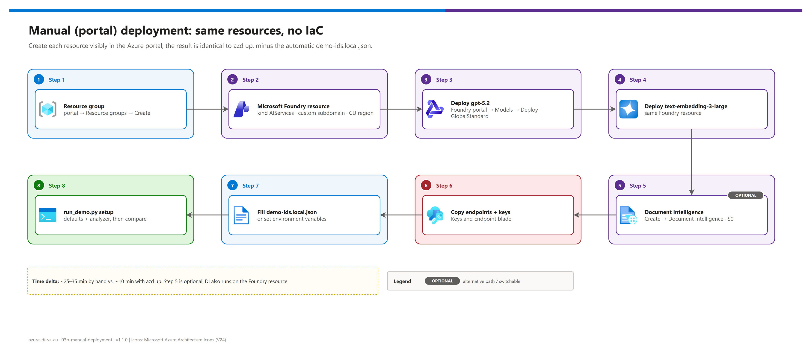

[README](../README.md) › 03b Manual deployment

# 03b - Manual deployment (portal, no IaC)

<p>
&nbsp;
&nbsp;
&nbsp;
&nbsp;
&nbsp;

</p>

  

The no-IaC alternative to [03 - Deployment](./03-deployment.md): create the same resources, with the same names and settings, by hand in the Azure portal (with the equivalent CLI command for each step). Use it when policy blocks Bicep / azd, or in a workshop where the audience should see each resource being created. Only the provisioning phases are duplicated here; analyzer setup and runs are identical to the IaC path.

## At a glance

| | Path | Time | What you do by hand |
|---|---|---|---|
|  | `azd up` | ~10 min | Nothing: hooks write `demo-ids.local.json` |
|  | **Portal (this page)** | **~25–35 min** | Create 2 accounts + 2 deployments, copy endpoints and keys into `demo-ids.local.json` |

## Step flow

[](./assets/manual-deployment-steps.png)

<sub>Editable source: [`assets/manual-deployment-steps.drawio`](./assets/manual-deployment-steps.drawio).</sub>

> [!WARNING]
> Even in the portal, check the directory + subscription picker (top-right) before every **Create**. For the CLI equivalents, run Phase 0 from [03 - Deployment](./03-deployment.md#phase-0-authenticate-to-the-right-tenant) first and pass `--subscription` on every command.

## Phase 1: Resource group

| Step | | Portal | CLI equivalent |
|---|---|---|---|
| **1** |  | **Resource groups → Create**: name `rg-di-vs-cu`, region = a Content Understanding region (e.g. East US 2) | `az group create --subscription <SUB> -n rg-di-vs-cu -l eastus2` |

- [ ] Resource group exists in a CU region ([02 - Prerequisites](./02-prerequisites.md#region-alignment))

## Phase 2: Microsoft Foundry resource (Content Understanding)

| Step | | Portal | CLI equivalent |
|---|---|---|---|
| **2** |  | **Create a resource → Microsoft Foundry** (kind *AIServices*): name `<base>-foundry`, same region, pricing tier S0. Keep public network access for the demo | `az cognitiveservices account create --subscription <SUB> -g rg-di-vs-cu -n <base>-foundry -l eastus2 --kind AIServices --sku S0 --custom-domain <base>-foundry` |
| **3** |  | Foundry portal → **Models + endpoints → Deploy model** → `gpt-5.2`, deployment name `gpt-5.2`, type Global Standard | `az cognitiveservices account deployment create --subscription <SUB> -g rg-di-vs-cu -n <base>-foundry --deployment-name gpt-5.2 --model-name gpt-5.2 --model-version 2025-12-11 --model-format OpenAI --sku-name GlobalStandard --sku-capacity 50` |
| **4** |  | Same → `text-embedding-3-large`, deployment name `text-embedding-3-large`, Global Standard | same command with `--deployment-name text-embedding-3-large --model-name text-embedding-3-large --model-version 1` |

> [!IMPORTANT]
> The **custom subdomain** is what makes the Content Understanding endpoint resolve as `https://<base>-foundry.services.ai.azure.com/`. The portal sets it from the resource name; with the CLI pass `--custom-domain`.

- [ ] Foundry resource shows both deployments as *Succeeded*

## Phase 3: Document Intelligence (optional)

| Step | | Portal | CLI equivalent |
|---|---|---|---|
| **5** |  | **Create a resource → Document Intelligence**: name `<base>-docintel`, same region, S0 | `az cognitiveservices account create --subscription <SUB> -g rg-di-vs-cu -n <base>-docintel -l eastus2 --kind FormRecognizer --sku S0 --custom-domain <base>-docintel` |

> [!TIP]
> Skipping this step is fine: Document Intelligence also runs on the Foundry resource. Point `documentIntelligenceEndpoint` at `https://<base>-foundry.cognitiveservices.azure.com/` and use the Foundry key.

## Phase 4: Configuration

| Step | | Portal | CLI equivalent |
|---|---|---|---|
| **6** |  | Each resource → **Keys and Endpoint** → copy Key 1 + endpoint | `az cognitiveservices account keys list --subscription <SUB> -g rg-di-vs-cu -n <name> --query key1 -o tsv` |
| **7** |  | `Copy-Item demo-ids.template.json demo-ids.local.json` and fill the endpoints, keys and model names | or export `DOCUMENTINTELLIGENCE_ENDPOINT` / `_KEY`, `CONTENTUNDERSTANDING_ENDPOINT` / `_KEY` |
| **8** |  | `python src/run_demo.py check` → `setup` → `compare` | continue in [03 - Deployment, Phase 2](./03-deployment.md#phase-2-content-understanding-setup) |

<details><summary><b>Minimal demo-ids.local.json</b></summary>

```json
{
  "documentIntelligenceEndpoint": "https://<base>-docintel.cognitiveservices.azure.com/",
  "documentIntelligenceKey": "<key>",
  "contentUnderstandingEndpoint": "https://<base>-foundry.services.ai.azure.com/",
  "contentUnderstandingKey": "<key>",
  "cuCompletionModel": "gpt-5.2",
  "cuCompletionDeployment": "gpt-5.2",
  "cuEmbeddingModel": "text-embedding-3-large",
  "cuEmbeddingDeployment": "text-embedding-3-large"
}
```

</details>

> [!CAUTION]
> The manual path does **not** write `demo-ids.local.json` for you, and that file holds keys. It is gitignored; never `git add -f` it and never paste keys into docs, tickets or recordings.

- [ ] `python src/run_demo.py check` shows `[OK]` on both services

## Cleanup

| Step | | Portal | CLI equivalent |
|---|---|---|---|
| **9** |  | Delete the resource group, then **Foundry / Azure AI services → Manage deleted resources → Purge** | `az group delete --subscription <SUB> -n rg-di-vs-cu --yes` then `az cognitiveservices account purge …` |

---

Next: [04 - Testing](./04-testing.md) →

*Last updated: 2026-10-07*
