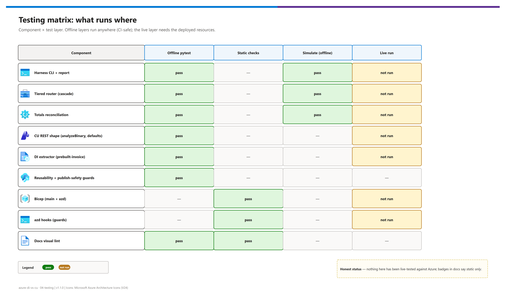
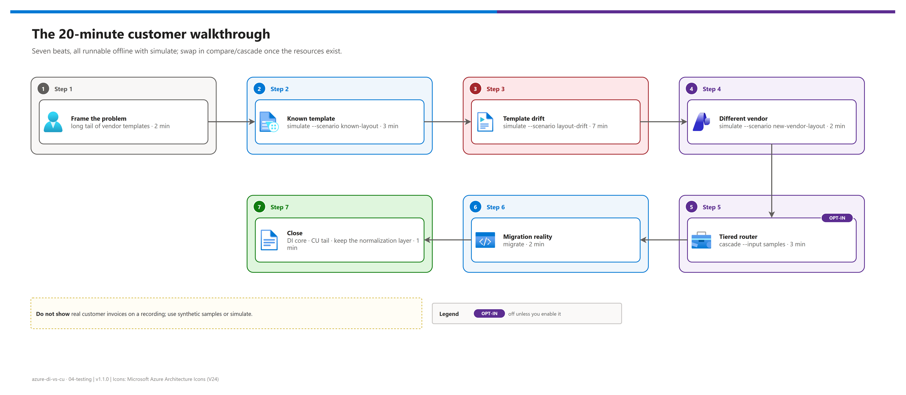

[README](../README.md) › 04 Testing

# 04 - Testing and demo script

<p>
&nbsp;
&nbsp;
&nbsp;
&nbsp;

</p>

  

How to prove the harness works (offline tests, static checks, `simulate`), what to expect from a live run, and the scripted 20-minute customer walkthrough. It is for whoever rehearses or presents the demo, and for anyone changing the code. Every offline layer runs without Azure or credentials; the live layer needs the resources from [03 - Deployment](./03-deployment.md).

## At a glance

| | Layer | Command | Status |
|---|---|---|---|
|  | Offline unit + guard tests | `python -m pytest` |  passing |
|  | Offline comparison | `python src/run_demo.py simulate` |  passing |
|  | IaC + hooks | `az bicep build`, hook parse + guard checks |  passing |
|  | Live run | `check` → `setup` → `compare` → `cascade` | not yet run against Azure |

## Testing matrix

[](./assets/testing-matrix.png)

<sub>Editable source: [`assets/testing-matrix.drawio`](./assets/testing-matrix.drawio).</sub>

## Offline tests (no Azure)

```bash
pip install -r requirements-dev.txt
python -m pytest -q
```

| Test file | What it proves |
|---|---|
| `tests/test_harness.py` | `simulate` writes a report + sidecar with a 2/3 escalation rate; totals reconciliation flags the shifted column a row count misses; the critical-field gate (and a custom gate) escalates for the right reason; DI currency comes from `valueCurrency`; CU uses `:analyzeBinary` (`2025-11-01`), `PATCH defaults` and injects the `models` block; both analyzer schemas use the `2025-11-01` shape |
| `tests/test_reusability_guards.py` | No engagement-specific words, private-notes or internal references, real GUIDs or key-like tokens anywhere in the tree; `.gitignore` covers secrets and outputs; a receipt workload resolves by configuration only |
| `tests/test_configuration.py` | Every azd parameter, Bicep output, hook variable and config key is documented in [08](./08-configuration-reference.md); `azd.bicep` passes every `main.bicep` parameter |
| `tests/test_doc_visuals.py` | Docs meet the visual standard (`scripts/lint_doc_visuals.py`) |

> [!NOTE]
> The CU and DI extractors are tested against recorded response *shapes* with a fake HTTP session, not against the services. That proves the request contract (URL, method, body) matches the GA API; it does not prove extraction quality. Only a live run does that.

## Static checks (regression checklist)

```powershell
python -m pytest -q
python scripts/lint_doc_visuals.py --strict          # visuals + links + anchors
python scripts/export_diagrams.py docs/assets --check  # no missing / stale PNGs
az bicep build --file infra/main.bicep --stdout > $null
az bicep build --file infra/azd.bicep --stdout > $null
azd show                                              # azure.yaml parses
```

<details><summary><b>Hook guard checks (no Azure calls)</b></summary>

```powershell
$env:AZURE_ENV_NAME = 'Bad-Name';  ./infra/hooks/preprovision.ps1   # -> AZURE_ENV_NAME must be 3-12 characters ...
$env:AZURE_ENV_NAME = 'dicu-demo'; $env:AZURE_LOCATION = 'northeurope'
./infra/hooks/preprovision.ps1                                        # -> not a Content Understanding region
$env:AZURE_LOCATION = 'eastus2';   $env:AZURE_TENANT_ID = ''
./infra/hooks/preprovision.ps1                                        # -> AZURE_TENANT_ID and AZURE_SUBSCRIPTION_ID must be set
```

</details>

## Live validation

Not yet executed against Azure; every row below is the **expected** result.

| Check | Expected | Status |
|---|---|---|
| `check` | `[OK]` on both services, sample count > 0 | ⏳ |
| `setup` | `Content Understanding defaults set`, analyzer created or "already exists" | ⏳ |
| `compare` on a known template | DI coverage > 85 %, mean confidence > 0.85, totals reconcile on both | ⏳ |
| `compare` on a revised template | DI coverage drops on the changed regions; DI totals may fail reconciliation | ⏳ |
| `compare` on an unfamiliar template | DI coverage drops sharply; CU stays high | ⏳ |
| `cascade` on a known template | Resolves at tier 1 (`document-intelligence`) | ⏳ |
| `cascade` on a drifted / unfamiliar template | Escalates to `content-understanding` with the reason printed | ⏳ |

> [!IMPORTANT]
> When you run it live, replace ⏳ with ✅ / ❌, save the report and charts under `docs/assets/evidence/` (redact keys and document content), and switch this page's badge to *live-tested* only for the rows that actually ran.

## The 20-minute demo script

[](./assets/demo-walkthrough-story.png)

<sub>Editable source: [`assets/demo-walkthrough-story.drawio`](./assets/demo-walkthrough-story.drawio).</sub>

| Beat | | Run | Expected result | Say |
|---|---|---|---|---|
| **1 · Frame** (2 min) |  | — | — | "Known formats extract well. New or *slightly changed* formats collapse. The question isn't which service is better; it's which is right for which slice of your volume." |
| **2 · Known template** (3 min) |  | `simulate --scenario known-layout` | DI 92 % coverage, 0.97 mean confidence, ~2x faster; totals reconcile on both | "On this document, Document Intelligence is the right answer. Don't pay for reasoning you aren't using." |
| **3 · Template drift** (7 min) |  | `simulate --scenario layout-drift` | DI 54 %: `InvoiceId` = "Document Ref." (0.34), `InvoiceTotal` = tax line (0.42); row count 3 = 3 but DI sum 0.14 = MISMATCH; CU reconciles | "A missing field fails loudly. A wrong field posts to the ERP." |
| **4 · Different vendor** (2 min) |  | `simulate --scenario new-vendor-layout` | DI 23 %, `VendorName` = "ORDER CONFIRMATION"; CU finds the PO in body text and flags it | "Same data, different structure: binding by meaning holds up." |
| **5 · Tiered router** (3 min) |  | `cascade --input samples` (or the cascade section of the simulate report) | Known template stays on tier 1; drift scenarios escalate with the reason | "Your escalation rate decides the architecture, not us." |
| **6 · Migration** (2 min) |  | `migrate` | Field contract ports; client, parsing, confidence logic are real work | "Not plug-and-play. Normalize both services into one shape and the service becomes swappable." |
| **7 · Close** (1 min) |  | — | — | "DI for the stable core, CU for the long tail, keep the normalization layer either way." |

> [!CAUTION]
> Do not show real customer invoices on a recording or a shared screen. Use synthetic samples or `simulate`, and say out loud that `simulate` numbers are illustrative.

> [!TIP]
> Set the template-drift beat up **before** showing results: same vendor, same language, same currency, same products, just a relabeled header, totals moved to a sidebar and one extra column. Then walk the three beats: partial failure, wrong-not-missing total, row count agrees but the data is corrupt.

## Strategy comparison and tuning

```bash
python src/run_demo.py cascade --input samples --strategy di-only
python src/run_demo.py cascade --input samples --strategy cu-only
python src/run_demo.py cascade --input samples --strategy cascade
```

| Knob | Setting | Effect |
|---|---|---|
| Threshold | `CONFIDENCE_THRESHOLD=0.75` | Stricter: escalate more |
| Critical fields | `CRITICAL_FIELDS=VendorName,InvoiceId,InvoiceTotal` | Which fields block a no-touch post |
| Analyzer schema | `CU_ANALYZER_SCHEMA=analyzers/<file>.json` + `setup --recreate` | CU quality tracks description quality |

Sweep the threshold across a representative document set and plot escalation rate against error rate; the knee of that curve is your production setting. The `comparison-*.json` sidecars are structured for spreadsheet analysis.

---

Next: [05 - Troubleshooting](./05-troubleshooting.md) →

*Last updated: 2026-10-07*
