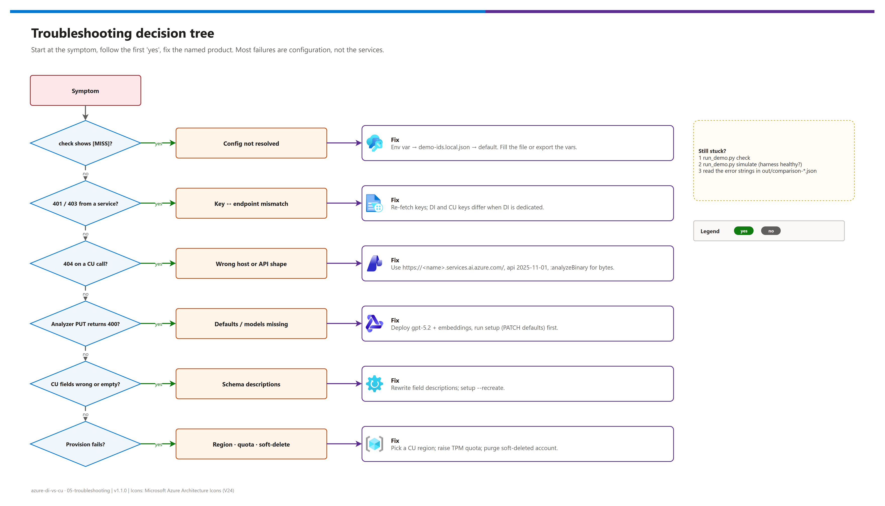

[README](../README.md) › 05 Troubleshooting

# 05 - Troubleshooting

<p>
&nbsp;
&nbsp;
&nbsp;
&nbsp;

</p>

  

Symptom-first diagnosis for the harness, both services and the deployment. Start with the quick-triage table; most failures are configuration (wrong endpoint host, key from another resource, API shape from a preview version, model defaults not set), not the services. For deeper context on each product, follow the per-section links to Microsoft Learn.

## At a glance

| | First three things to run | Tells you |
|---|---|---|
|  | `python src/run_demo.py check` | What actually resolved: endpoints, masked keys, API version, models, critical fields |
|  | `python src/run_demo.py simulate` | Whether the harness itself is healthy (no Azure involved) |
|  | `out/comparison-*.json` | The raw error string per service, per document |

## Decision tree

[](./assets/troubleshooting-decision-tree.png)

<sub>Editable source: [`assets/troubleshooting-decision-tree.drawio`](./assets/troubleshooting-decision-tree.drawio).</sub>

## Quick triage

| Where | Symptom | Likely cause | Fix |
|---|---|---|---|
|  Config | `check` shows `[MISS]` | Nothing resolved: env var → `demo-ids.local.json` → default | Fill `demo-ids.local.json` or export the variables in the same shell |
|  DI | `401` / `Access denied` | Key from a different resource than the endpoint | Re-fetch the key for that exact account |
|  CU | `404` on analyze | `.cognitiveservices.azure.com` host, or bytes posted to `:analyze` | Use `https://<name>.services.ai.azure.com/` and `:analyzeBinary` |
|  CU | `400` on analyzer `PUT` | Model defaults not mapped / deployments missing | `python src/run_demo.py setup` (PATCHes defaults first) |
|  CU | `400` mentioning `baseAnalyzerId` | Schema from an earlier API version (`prebuilt-documentAnalyzer`) | Use `prebuilt-document` + a `models` block |
|  CU | Fields wrong or empty | Field descriptions | Rewrite descriptions, `setup --recreate` |
|  Deploy | Hook: "Refusing to continue…" | `az` signed in to another tenant / subscription | `az login --tenant …` + `az account set …` |
|  Deploy | `InsufficientQuota` / `SkuNotAvailable` | Model quota or region | Lower `CU_*_CAPACITY`, pick another CU region |
|  Deploy | `CustomDomainInUse` / name conflict | Soft-deleted account holds the subdomain | Purge it (`az cognitiveservices account purge`) |

##  Configuration

```bash
python src/run_demo.py check   # shows what actually resolved
```

- `demo-ids.local.json` must exist (copy from `demo-ids.template.json`) or the env vars must be set **in the same process**: each new PowerShell invocation starts fresh.
- Endpoints start with `https://` and end with `/`.
- `[MISS]` on Content Understanding only is expected while access/resources are pending: run `simulate` meanwhile.

> [!NOTE]
> Settings resolve in this order: environment variable → `demo-ids.local.json` (top-level key, then the `workload` block) → code default. See [08 - Configuration reference](./08-configuration-reference.md).

##  Document Intelligence

| Symptom | Cause | Fix |
|---|---|---|
| `401 Unauthorized` | Key and endpoint belong to different resources | `az cognitiveservices account keys list -n <name> -g <rg> --query key1 -o tsv` |
| `404 Resource not found` | Regional endpoint instead of the custom subdomain | Use `https://<resource-name>.cognitiveservices.azure.com/` |
| "returned no documents" | The model ran but found no invoice-like document | A legitimate tier-1 failure; the report keeps all fields as empty so coverage stays honest |
| `InvalidRequest` | Unsupported or password-protected file | PDF, JPEG, PNG, BMP, TIFF, HEIF, DOCX, XLSX, PPTX are supported; remove PDF protection |
| `TypeError` on `begin_analyze_document` | SDK signature drift | `pip install --upgrade azure-ai-documentintelligence`; never the retired `azure-ai-formrecognizer` |
| `CurrencyCode` empty for DI | prebuilt-invoice has no currency field | Expected when no amount carries `currencyCode`; the harness reads it from `InvoiceTotal` / `SubTotal` |

##  Content Understanding

| Symptom | Cause | Fix |
|---|---|---|
| `404` on any call | Wrong host, or no custom subdomain on the Foundry resource | `https://<name>.services.ai.azure.com/`; the Bicep sets `customSubDomainName` |
| `404` / `400` on analyze with a file | Earlier-API pattern: raw bytes posted to `:analyze` | `2025-11-01` uses `:analyzeBinary` for bytes; `:analyze` takes `{"inputs":[{"url":…}]}` |
| `400` on analyzer creation | `models` not mapped in `contentunderstanding/defaults`, or deployments missing | Run `setup` (without `--skip-defaults`) after provisioning completes |
| `409 Conflict` on analyzer creation | It already exists | `setup` reuses it; `setup --recreate` to apply schema edits |
| `403 Forbidden` | Region not supported, or key/RBAC mismatch | Check the CU region list; re-fetch the Foundry key |
| "operation timed out" | Large / multi-page document | Raise `POLL_TIMEOUT_SECONDS` in `src/cu_extractor.py` |
| Confidence shows `n/r` | `estimateFieldSourceAndConfidence` off for that field | It is on in the bundled schema; with it on, `2025-11-01` returns confidence for extract, generate and classify fields |

> [!TIP]
> Poor CU extraction is almost always the schema, not the service. Say what each field *means*, disambiguate confusable pairs ("the party being PAID, not the buyer"), list alternate labels vendors use, and state the output format ("ISO 8601", "plain number"). Then `setup --recreate`.

> [!WARNING]
> If you change `CU_API_VERSION` to `2026-06-01-preview`, you are on a preview API with no SLA; the harness was written for `2025-11-01`. Check [What's new](https://learn.microsoft.com/azure/ai-services/content-understanding/whats-new) for behavior changes first.

##  Reports

| Symptom | Cause | Fix |
|---|---|---|
| "differs" on values that look identical | A real disagreement: currency envelopes, numeric strings and address formatting are already normalized | Investigate; a different date reading is the most common and most important case |
| Markdown table renders broken | A new field interpolated without `_fmt()` | Route values through `_fmt()` in `src/compare.py` (escapes `\|`) |
| `out/` is empty | The run crashed before the end | Reports are written after all documents; read the console output |

##  Deployment and azd

| Symptom | Cause | Fix |
|---|---|---|
| "Refusing to continue with the wrong Azure CLI tenant/subscription" | `az` and azd signed in to different tenants | `az login --tenant <id>` + `az account set --subscription <id>`, re-run |
| "AZURE_ENV_NAME must be 3-12 characters…" | Name feeds the custom subdomains | `azd env new <short-lowercase-name>` |
| "not a Content Understanding region" | `AZURE_LOCATION` outside the CU list | `azd env set AZURE_LOCATION eastus2` |
| `InsufficientQuota` on a deployment | TPM quota | Lower `CU_COMPLETION_CAPACITY` / `CU_EMBEDDING_CAPACITY` or request quota |
| Postprovision: "Could not read account keys" | `DISABLE_LOCAL_AUTH=true` or no `listKeys` permission | Expected with Entra-only; switch the harness to Entra ID or set keys via env vars |

---

Next: [06 - Decision guide](./06-di-vs-cu-decision-guide.md) →

*Last updated: 2026-10-07*
