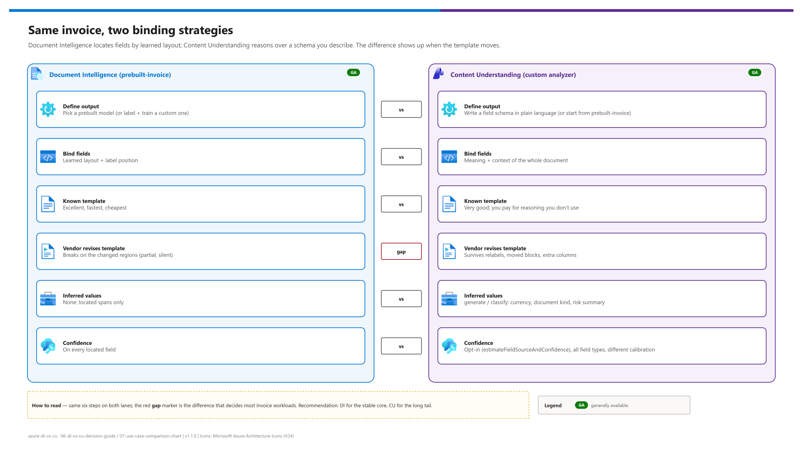

[README](../README.md) › 06 Decision guide

# 06 - Document Intelligence vs. Content Understanding: decision guide

<p>
&nbsp;
&nbsp;
&nbsp;

</p>

   

The customer-facing artifact: what is actually different between Azure Document Intelligence and Azure Content Understanding (both Foundry Tools), when to choose which, when to use both, and what a migration really costs. It is written to be forwarded on its own to architects and decision makers, and it is aligned with Microsoft Learn's [Choose the right Azure AI tool for document processing](https://learn.microsoft.com/azure/ai-services/content-understanding/choosing-right-ai-tool). Numbers quoted here come from the harness's `simulate` mode and are illustrative; run `compare` on your own documents for real ones.

## At a glance

| | Question | Short answer |
|---|---|---|
|  | Standard, stable layouts at volume? | **Document Intelligence**: cheapest, fastest, confidence on every field |
|  | Many vendors, templates that change, inferred values? | **Content Understanding** custom analyzer |
|  | Mostly stable with a persistent long tail? | **Both**: DI first, escalate to CU on a critical-field gate |
|  | Already running DI in production? | No forced migration: DI APIs, endpoints, SDKs and billing are unchanged |

## The one-sentence version

**Document Intelligence extracts what it can locate on a page it recognizes. Content Understanding reasons about what the document means, against a schema you describe in plain language.** That distinction drives every practical difference below.

[](./assets/di-vs-cu-comparison.png)

<sub>Editable source: [`assets/di-vs-cu-comparison.drawio`](./assets/di-vs-cu-comparison.drawio).</sub>

## Capability comparison

| Dimension |  Document Intelligence |  Content Understanding |
|---|---|---|
| **Core approach** | Trained extraction models (prebuilt or custom) that locate fields by learned layout and label patterns | Generative-AI analyzers (prebuilt or custom) that reason over content, guided by field descriptions |
| **How you define output** | Pick a prebuilt model, or train a custom model on labeled samples (from 5 per variant) | Start from a prebuilt analyzer (e.g. `prebuilt-invoice`) or write a field schema in plain language: zero-shot, labeled samples optional |
| **Consistent layouts** | **Excellent**: its sweet spot | Very good, but you pay for capability you aren't using |
| **Vendor changes the template** | **Breaks on the changed regions**: renamed labels and moved blocks lose their anchors | **Survives it**: binds by meaning, not position |
| **Unseen vendor layouts** | Degrades sharply; fields go missing or bind to the wrong span | Holds up; generalizes across template and language variation |
| **Confidence + grounding** | Per-field confidence on everything it locates | Opt-in (`estimateFieldSourceAndConfidence`); now covers extract, generate and classify fields; calibrated differently |
| **Inferred values** | None: only spans physically on the page | `generate` and `classify` (currency, document kind, risk summary) |
| **Content types** | Documents, images | Documents, images, **audio, video** |
| **Deployment options** | Cloud + containers (incl. disconnected) | Cloud; needs a Microsoft Foundry resource + model deployments |
| **Latency / cost per page** | Lower / lower | Higher / higher (extraction + contextualization + model tokens) |
| **Status** |  v4.0 `2024-11-30` |  `2025-11-01` ·  `2026-06-01-preview` |
| **Recommendation** | **The stable, high-volume core** | **The long tail, drift-prone vendors, anything needing reasoning** |

> [!NOTE]
> Content Understanding also ships `prebuilt-read` and `prebuilt-layout`, which bring Document Intelligence's OCR/layout capabilities into CU. Microsoft Learn recommends them for OCR- or layout-only workloads ("lower cost and richer layout extractions"). This harness keeps DI `prebuilt-read` as tier 3 so the comparison stays service-pure.

## Choose which, when

| Situation | Choose | Why |
|---|---|---|
| Layouts are standardized and change rarely (top vendors, internal or EDI-adjacent forms) |  **Document Intelligence** | Known templates extract at high confidence, cheapest and fastest |
| An existing auto-post gate is calibrated on DI's per-field confidence |  **Keep DI in the loop** | Re-baselining that gate is real work |
| On-premises or air-gapped |  **DI containers** | The only option today |
| Vendor templates vary or **change over time** |  **Content Understanding** | The dominant real-world failure mode for layout-bound extraction |
| New formats appear continuously; no time for label + retrain |  **Content Understanding** | Schema-driven: usually zero change to onboard |
| Values the page doesn't state literally, classification, summaries |  **Content Understanding** | `generate` / `classify` methods |
| Audio or video in the same pipeline |  **Content Understanding** | DI is documents and images only |
| Mostly stable, persistent long tail |  **Tiered cascade** | The expensive tier only sees what needs it |

## Use both: the tiered pattern

[](./assets/tiered-router-decision.png)

<sub>Editable source: [`assets/tiered-router-decision.drawio`](./assets/tiered-router-decision.drawio).</sub>

**Critical-field gate.** The router does not escalate on a low *average*: an average hides a single catastrophic miss. It escalates when any of `VendorName`, `InvoiceId`, `InvoiceTotal`, `PurchaseOrder` or `InvoiceDate` is missing or below the threshold, because those fields are what cause a human touch. Both the list and the threshold are configuration (`CRITICAL_FIELDS`, `CONFIDENCE_THRESHOLD`).

## "Can Content Understanding just replace the cascade?"

A fair question, and the harness answers it with your data rather than an opinion:

```bash
python src/run_demo.py cascade --input samples --strategy di-only
python src/run_demo.py cascade --input samples --strategy cu-only
python src/run_demo.py cascade --input samples --strategy cascade
```

| Strategy | Accuracy | Blended cost | Latency | Choose when |
|---|---|---|---|---|
| **di-only** | Baseline; the escalation reasons are your exceptions today | Lowest | Fastest | Escalation rate is near zero |
| **cu-only** | Usually the accuracy ceiling | Highest: every page pays the LLM tier | Slowest | Escalation rate is high (> ~60 %) |
| **cascade** | Approaches cu-only | Lowest blended when escalation is low | Mixed | Escalation rate is low (< ~20 %) |
| **Recommendation** | — | — | — | **Decide on the escalation rate**, printed in every report |

> [!TIP]
> Keep the second-order argument in view: if your auto-post gate depends on per-field confidence, compare how each service's confidence correlates with *actual* errors on your documents before dropping either. CU's confidence is opt-in and calibrated differently from DI's.

## "Can we migrate DI to CU without redevelopment?"

Not plug-and-play, and often not necessary: Microsoft's guidance is that existing DI workloads keep working unchanged. If you *choose* to move a workload, run `python src/run_demo.py migrate` for the assessment:

| Migrates cleanly | Needs real work |
|---|---|
| Field names and types (1:1) | Client library and call pattern (`azure-ai-contentunderstanding` or REST: defaults → analyzer → `analyzeBinary`) |
| Line-item table structure | Response parsing: `documents[0].fields` → `result.contents[0].fields` |
| The ERP-facing contract, **if** you normalize both services into one internal shape first | Confidence logic: DI thresholds don't transfer |
| | Schema authoring: the effort moves from labeling to writing good field descriptions; plus model deployments + defaults |

**Target `2025-11-01` for production.** Evaluate `2026-06-01-preview` only if you specifically need agentic mode, synchronous Read/Layout, signature detection or the classification enhancements.

> [!IMPORTANT]
> The single most valuable architectural decision is the one in `src/models.py`: normalize both services into one internal result shape. Do that, and the service becomes a swappable implementation detail behind a stable contract. Skip it, and the service choice gets welded into your flows and ERP integration.

## Talking points that land

| # | Point | Behind it |
|---|---|---|
| 1 | "Low accuracy on new formats isn't a tuning problem, it's a fit problem." | A prebuilt model binds by learned layout; an unfamiliar template is out of distribution |
| 2 | "The failure mode is template churn, not exotic documents." | A renamed header + moved totals block + one extra column is enough |
| 3 | "Partial failure is worse than total failure." | Vendor and address still extract perfectly; the total binds to the tax line |
| 4 | "Confidence is a feature, not a metric." | Low DI confidence is DI telling you to escalate |
| 5 | "The schema is the product." | CU output quality tracks description quality; that sentence is the engineering work |
| 6 | "Not either/or." | DI for the stable core, CU for the tail; the escalation rate tells you where the line sits |

## Verify before you quote

Capabilities, regions, models and pricing move, and Content Understanding is versioning quickly. Confirm against current docs before putting numbers in front of anyone:

| Topic | Source |
|---|---|
| CU status, versions, new features | [What's new in Content Understanding](https://learn.microsoft.com/azure/ai-services/content-understanding/whats-new) |
| Choosing between the two | [Choose the right Azure AI tool for document processing](https://learn.microsoft.com/azure/ai-services/content-understanding/choosing-right-ai-tool) |
| CU regions, supported models | [Region support](https://learn.microsoft.com/azure/ai-services/content-understanding/language-region-support) · [Service limits](https://learn.microsoft.com/azure/ai-services/content-understanding/service-limits) |
| CU pricing model | [Pricing explainer](https://learn.microsoft.com/azure/ai-services/content-understanding/pricing-explainer) |
| DI overview, versions, retirements | [What is Document Intelligence](https://learn.microsoft.com/azure/ai-services/document-intelligence/overview) · [What's new](https://learn.microsoft.com/azure/ai-services/document-intelligence/whats-new) |
| DI invoice model | [Invoice data extraction](https://learn.microsoft.com/azure/ai-services/document-intelligence/prebuilt/invoice) |

---

Next: [07 - Use-case comparison chart](./07-use-case-comparison-chart.md) →

*Last updated: 2026-10-07*
