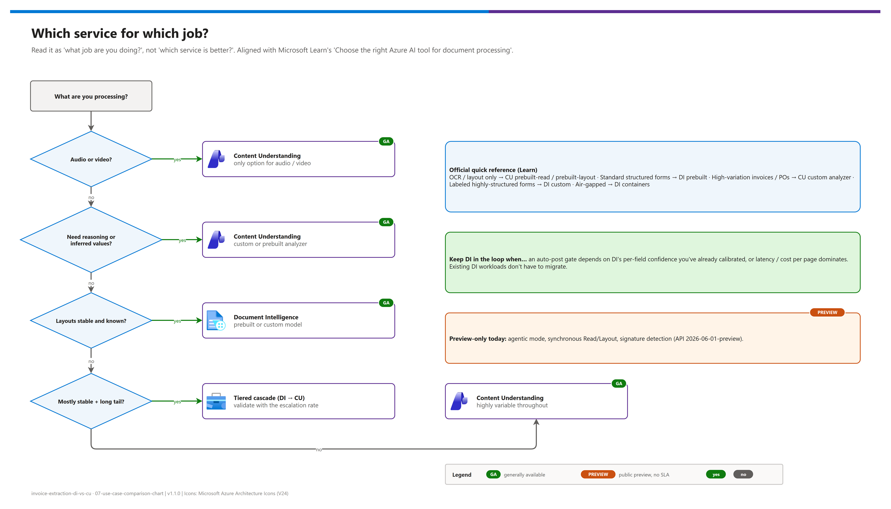

[README](../README.md) › 07 Use-case comparison chart

# 07 - Use-case comparison chart

&nbsp;
&nbsp;
&nbsp;
&nbsp;

  

The "which service for which job" charts, built to be lifted onto slides: use case → service, capability matrix, the template-drift problem, industry patterns, a decision flow, and cost / effort. Read every chart as "what job are you doing?", not "which service is better?". Status as of **2026-10-07**: Content Understanding `2025-11-01` is GA and `2026-06-01-preview` is in public preview; Document Intelligence v4.0 (`2024-11-30`) is GA. Re-verify on [What's new](https://learn.microsoft.com/azure/ai-services/content-understanding/whats-new) before quoting.

## At a glance

| | Chart | Use it for |
|---|---|---|
|  | 1 · Use case → service | The opening slide: map the audience's document jobs |
|  | 2 · Capability matrix | The technical audience |
|  | 3 · Template drift | The "why" behind the difference |
|  | 4 · Industry patterns | "Where else does this apply?" |
|  | 5 · Decision flow | Closing the conversation |
|  | 6 · Cost and effort | Budget owners |

## Chart 1: Use case to service

| Use case | Document Intelligence | Content Understanding | Why |
|---|:--:|:--:|---|
| **Standardized forms at volume** (tax, insurance, EDI-adjacent) | ✅ **Best fit** | ⚠️ Works, costs more | Stable layouts are what prebuilt / custom DI models are trained for |
| **Invoices / POs from a stable vendor set** | ✅ **Best fit** | ⚠️ Works, costs more | Known templates extract at high confidence, cheaper per page |
| **Invoices / POs from a long tail of vendors** | ⚠️ Degrades per template | ✅ **Best fit** | Binding by meaning survives template variation |
| **Vendor changes their template** | ❌ Silent partial failure | ✅ **Best fit** | The highest-value differentiator (Chart 3) |
| **Onboarding a new document format** | ⚠️ Label + retrain | ✅ **Best fit** | Schema-driven, zero-shot to start |
| **Contracts, policies, regulatory docs** | ⚠️ Extraction only | ✅ **Best fit** | Needs reasoning and inferred fields (`prebuilt-contract`, custom analyzers) |
| **Classification** ("what kind of doc is this?") | ⚠️ Custom classifier model | ✅ **Best fit** | `classify` fields and content categories, layout-independent |
| **Summaries / risk commentary** | ❌ Not supported | ✅ **Best fit** | `generate` produces reasoned output, not located spans |
| **Audio** (calls, meetings, dictation) | ❌ Not supported | ✅ **Only option** | CU is multimodal |
| **Video** (scenes, on-screen text) | ❌ Not supported | ✅ **Only option** | CU is multimodal |
| **Multi-document / mixed media** | ❌ Not supported | ✅ **Best fit** | Multimodal analyzers + agent-framework integrations |
| **RAG-ready preprocessing** | ⚠️ Layout output you chunk yourself | ✅ **Best fit** | `prebuilt-documentSearch` returns chunked, structure-aware output |
| **Auto-post gate needing per-field confidence** | ✅ **Best fit** | ⚠️ Opt-in, different calibration | DI reports confidence on every located field |
| **On-premises / air-gapped** | ✅ **Only option** (containers) | ❌ Cloud only | DI containers |
| **Lowest cost per page at scale** | ✅ **Best fit** | ⚠️ Higher | Don't pay for reasoning you aren't using |

## Chart 2: Capability matrix

| Capability |  Document Intelligence |  Content Understanding |
|---|---|---|
| Content types | Documents, images | Documents, images, **audio, video** |
| How output is defined | Prebuilt model, or custom model trained on labeled samples | Prebuilt analyzer, or field schema in natural language (+ optional labeled samples) |
| Onboarding a new format | Label samples → train → deploy | Usually no change; refine descriptions |
| Field binding | Learned layout + label patterns | Meaning and context |
| Extraction | ✅ | ✅ |
| Classification | ✅ Custom classifier | ✅ `classify` / content categories |
| Inferred / reasoned values | ❌ | ✅ `generate` |
| Per-field confidence | ✅ On everything located | ✅ Opt-in, all field types |
| Grounding / source spans | ✅ | ✅ Opt-in |
| Agentic mode, synchronous Read/Layout, signatures | ❌ | ⏳  `2026-06-01-preview` |
| Containers | ✅ | ❌ |
| Latency / cost per page | Lower / lower | Higher / higher |
| Status |  |  `2025-11-01` |
| **Recommendation** | **Stable, high-volume core** | **Long tail + anything needing reasoning** |

## Chart 3: The template-drift problem

Editable source: [`assets/template-drift-infographic.drawio`](./assets/template-drift-infographic.drawio). Numbers are from `simulate` (illustrative).

| What changed on the document | DI impact | CU impact |
|---|---|---|
| Nothing: known template | ✅ Full extraction, high confidence | ✅ Full extraction |
| Header label renamed (`Invoice #` → `Document Ref.`) | ❌ Binds to the label, or nothing | ✅ Still recognized as the invoice number |
| Totals block moved to a sidebar | ❌ Table-relative anchors lost | ✅ Located by meaning |
| Extra column in the line-item table | ❌ Column offset: values land in the wrong fields | ✅ Columns matched by header meaning |
| Same data, entirely different vendor structure | ❌ Largely fails to bind | ✅ Resolved from context |
| PO number in body text, not a header field | ❌ Not found | ✅ Found, flagged for confirmation |

> [!IMPORTANT]
> The dangerous part is that it's a **partial** failure. Vendor name and address still come through perfectly, so it looks like a good extraction with a few gaps, while the total has bound to the tax line. Reconcile totals; don't just count rows.

## Chart 4: Industry patterns

| Industry | Pattern | Better fit | What it proves |
|---|---|---|---|
|  Manufacturing / industrial AP | PO and invoice extraction across a long tail of supplier templates | Cascade → CU for the tail | Layout drift is the failure mode; schema-driven binding is the remedy |
|  Financial services, audit, compliance | Contracts, policies, regulatory filings | CU | Inferred fields + grounding + confidence where explainability matters |
|  Media and entertainment | Video / audio metadata: scenes, speakers, on-screen text | CU (only option) | The multimodal gap DI cannot address |
|  Insurance, public sector forms | High-volume standardized forms | DI | Stable layouts, per-field confidence, lowest cost |
|  Agents and knowledge apps | Grounded understanding before an agent reasons or acts | CU (`prebuilt-documentSearch`, custom analyzers) | Structured, chunked output ready for retrieval |

> [!NOTE]
> For named references, use Microsoft's public customer stories (customers.microsoft.com) for the specific industry, and cite only public sources in any deck you share.

## Chart 5: Decision flow

Editable source: [`assets/service-selection-decision.drawio`](./assets/service-selection-decision.drawio).

## Chart 6: Cost and effort

| Dimension | Document Intelligence | Content Understanding | Tiered cascade |
|---|---|---|---|
| Cost per page | Lowest | Highest (extraction + contextualization + model tokens) | DI rate + escalation rate × CU rate |
| Latency | Fastest | Slowest | Fast for most, slow for escalations |
| Build effort | Low for prebuilt; **high** for custom (labeling + training) | Medium: schema authoring + model deployments | Highest: both paths plus routing |
| Onboarding a new format | **High**: relabel and retrain | **Low**: usually no change | Low |
| Ongoing maintenance | **High** if vendors change templates | Low | Medium |
| Operational complexity | Low | Low | **Medium**: two services, routing, thresholds |
| **Recommendation** | Stable formats | Variable formats | Mostly stable + long tail, **only if escalation rate is low** |

> [!TIP]
> The cascade is worth its complexity only when the escalation rate is low. Under ~20 %: keep it, most pages stay cheap. Over ~60 %: you're paying twice on most pages; go CU-only and delete the routing logic. Every report prints that number.

## One-slide summary

| |  Document Intelligence |  Content Understanding |
|---|---|---|
| **Think of it as** | A trained reader that knows where fields sit | A reasoner that understands what the document means |
| **Strongest when** | Layouts are stable and known | Layouts vary or change |
| **Breaks when** | The template moves | Rarely on layout; cost and latency are the constraints |
| **Only it can do** | Containers; cheapest, fastest per page | Audio, video, inferred values, zero-shot schemas |
| **Status** |  |  · preview API for new features |
| **Use it for** | The stable high-volume core | The long tail, and anything needing reasoning |

> **"Not either/or. Document Intelligence for the core that's stable, Content Understanding for the tail that isn't, and your escalation rate tells you where the line sits."**

---

Next: [08 - Configuration reference](./08-configuration-reference.md) →

*Last updated: 2026-10-07*
