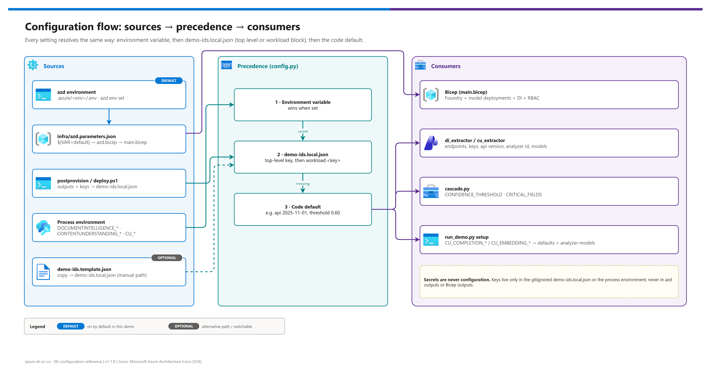

[README](../README.md) › 08 Configuration reference

# 08 - Configuration reference

&nbsp;
&nbsp;
&nbsp;
&nbsp;
&nbsp;

  

Every value you can set, in one page, so nobody has to read code to change a model, a region, a capacity, a name or the router's behavior. It covers the azd environment, the Bicep outputs and the `demo-ids.local.json` keys they become, the script-path parameters, the runtime environment variables the harness reads, and recipes for common changes. `tests/test_configuration.py` fails if any of these is added in code without being documented here.

## At a glance

| | Where configuration lives | Written by | Read by |
|---|---|---|---|
|  | azd environment (`.azure/<env>/.env`) | `azd env set`, Bicep outputs | `infra/azd.parameters.json`, hooks |
|  | `demo-ids.local.json` (gitignored) | postprovision hook, `infra/deploy.ps1`, or you | `src/config.py` |
|  | `infra/deploy.ps1` parameters | You | `infra/main.bicep` |
|  | Process environment | You / CI | `src/config.py` (wins over the file) |

## Overview and precedence

Editable source: [`assets/configuration-flow.drawio`](./assets/configuration-flow.drawio).

| Order | Source | Notes |
|---|---|---|
| 1 | Environment variable | Wins whenever it is set and non-empty |
| 2 | `demo-ids.local.json` | Top-level key first, then the same key inside the `workload` block |
| 3 | Code default | Listed in the tables below |

> [!CAUTION]
> Secrets are never configuration. Keys live only in the gitignored `demo-ids.local.json` or the process environment; they are never Bicep or azd outputs. For anything beyond a demo, use Microsoft Entra ID (`Cognitive Services User`) and `DISABLE_LOCAL_AUTH=true`.

## azd environment variables

###  Target and identity

| Variable | Default | Effect |
|---|---|---|
| `AZURE_ENV_NAME` | (required) | 3–12 chars, lowercase, starts with a letter; prefixes resource names and `rg-<env>` |
| `AZURE_TENANT_ID` | (required) | Tenant the hooks require `az` to be signed in to |
| `AZURE_SUBSCRIPTION_ID` | (required) | Subscription the hooks require `az` to target |
| `AZURE_LOCATION` | `eastus2` | Must be a Content Understanding region (preprovision checks) |
| `AZURE_RESOURCE_GROUP` | `rg-<env>` | Reuse an existing resource group |
| `AZURE_PRINCIPAL_ID` | set by azd | Principal granted `Cognitive Services User` on both accounts |
| `AZURE_PRINCIPAL_TYPE` | `User` | `User` or `ServicePrincipal` |

###  Platform

| Variable | Default | Effect |
|---|---|---|
| `DEPLOY_DEDICATED_DOCUMENT_INTELLIGENCE` | `true` | `false` = DI runs on the Foundry resource (one account, one key) |
| `DOCUMENT_INTELLIGENCE_SKU` | `S0` | `F0` or `S0` for the dedicated DI account |
| `DISABLE_LOCAL_AUTH` | `false` | `true` disables keys on both accounts (the harness then needs Entra ID) |

###  Models and capacity

| Variable | Default | Effect |
|---|---|---|
| `DEPLOY_MODELS` | `true` | Create the two deployments a CU custom analyzer needs |
| `CU_COMPLETION_MODEL` | `gpt-5.2` | Completion model name (must be in the CU supported-models list) |
| `CU_COMPLETION_MODEL_VERSION` | `2025-12-11` | Model version |
| `CU_COMPLETION_DEPLOYMENT` | `gpt-5.2` | Deployment name, mapped in `contentunderstanding/defaults` |
| `CU_COMPLETION_SKU` | `GlobalStandard` | Deployment SKU |
| `CU_COMPLETION_CAPACITY` | `50` | Thousands of tokens per minute |
| `CU_EMBEDDING_MODEL` | `text-embedding-3-large` | Embedding model name |
| `CU_EMBEDDING_MODEL_VERSION` | `1` | Model version |
| `CU_EMBEDDING_DEPLOYMENT` | `text-embedding-3-large` | Deployment name, mapped in `contentunderstanding/defaults` |
| `CU_EMBEDDING_SKU` | `GlobalStandard` | Deployment SKU |
| `CU_EMBEDDING_CAPACITY` | `50` | Thousands of tokens per minute |

###  Hook behavior

| Variable | Default | Effect |
|---|---|---|
| `WRITE_KEYS_TO_LOCAL_IDS` | `true` | postprovision copies account keys into `demo-ids.local.json` |
| `RUN_CU_SETUP` | `false` | postprovision runs `python src/run_demo.py setup` |
| `PYTHON` | `python` | Interpreter postprovision uses for `RUN_CU_SETUP` |

> [!NOTE]
> Every value in `infra/azd.parameters.json` is a quoted `${VAR=default}` substitution, including booleans and integers: azd parses the file as JSON before substituting, and ARM coerces the string to the declared parameter type.

## Outputs

| `azd.bicep` output | `demo-ids.local.json` key | Meaning |
|---|---|---|
| `AZURE_RESOURCE_GROUP` | `resourceGroup` | Resource group used |
| `AZURE_LOCATION` | `location` | Region deployed |
| `DOCUMENTINTELLIGENCE_ENDPOINT` | `documentIntelligenceEndpoint` | Dedicated DI endpoint, or the Foundry `cognitiveservices` endpoint |
| `DOCUMENTINTELLIGENCE_NAME` | (key lookup only) | Account the hook reads the DI key from |
| `CONTENTUNDERSTANDING_ENDPOINT` | `contentUnderstandingEndpoint` | `https://<name>.services.ai.azure.com/` |
| `FOUNDRY_NAME` | (key lookup only) | Account the hook reads the CU key from |
| `CU_COMPLETION_MODEL` | `cuCompletionModel` | Model name the analyzer references |
| `CU_COMPLETION_DEPLOYMENT` | `cuCompletionDeployment` | Deployment the defaults map it to |
| `CU_EMBEDDING_MODEL` | `cuEmbeddingModel` | Model name the analyzer references |
| `CU_EMBEDDING_DEPLOYMENT` | `cuEmbeddingDeployment` | Deployment the defaults map it to |

## Script-path parameters

| `infra/deploy.ps1` parameter | azd equivalent | Default |
|---|---|---|
| `-TenantId` | `AZURE_TENANT_ID` | (required) |
| `-SubscriptionId` | `AZURE_SUBSCRIPTION_ID` | (required) |
| `-ResourceGroup` | `AZURE_RESOURCE_GROUP` | (required) |
| `-BaseName` | derived from `AZURE_ENV_NAME` | (required, 3–18 chars) |
| `-Location` | `AZURE_LOCATION` | `eastus2` |
| `-DeployDedicatedDocumentIntelligence` | `DEPLOY_DEDICATED_DOCUMENT_INTELLIGENCE` | `$true` |
| `-DeployModels` | `DEPLOY_MODELS` | `$true` |
| `-CompletionModelName` | `CU_COMPLETION_MODEL` (+ deployment name) | `gpt-5.2` |
| `-CompletionModelVersion` | `CU_COMPLETION_MODEL_VERSION` | `2025-12-11` |
| `-EmbeddingModelName` | `CU_EMBEDDING_MODEL` (+ deployment name) | `text-embedding-3-large` |
| `-SkipKeys` | `WRITE_KEYS_TO_LOCAL_IDS=false` | off |

## demo-ids.local.json

| Key | Env var override | Default | Consumer |
|---|---|---|---|
| `tenantId` | `AZURE_TENANT_ID` | — | informational (tenant guard reference) |
| `subscriptionId` | `AZURE_SUBSCRIPTION_ID` | — | informational |
| `resourceGroup`, `location` | — | — | informational |
| `documentIntelligenceEndpoint` | `DOCUMENTINTELLIGENCE_ENDPOINT` | — | `di_extractor` |
| `documentIntelligenceKey` | `DOCUMENTINTELLIGENCE_KEY` | — | `di_extractor` (secret) |
| `contentUnderstandingEndpoint` | `CONTENTUNDERSTANDING_ENDPOINT` | — | `cu_extractor` |
| `contentUnderstandingKey` | `CONTENTUNDERSTANDING_KEY` | — | `cu_extractor` (secret) |
| `contentUnderstandingApiVersion` | `CU_API_VERSION` | `2025-11-01` | `cu_extractor` |
| `cuCompletionModel` / `cuCompletionDeployment` | `CU_COMPLETION_MODEL` / `CU_COMPLETION_DEPLOYMENT` | `gpt-5.2` / same | `setup` (defaults + analyzer `models`) |
| `cuEmbeddingModel` / `cuEmbeddingDeployment` | `CU_EMBEDDING_MODEL` / `CU_EMBEDDING_DEPLOYMENT` | `text-embedding-3-large` / same | `setup` |
| `confidenceThreshold` | `CONFIDENCE_THRESHOLD` | `0.60` | `cascade` |

###  The workload block (the only document-type-specific surface)

| Key (`workload.*`) | Env var override | Default | Consumer |
|---|---|---|---|
| `diModelId` | `DI_MODEL_ID` | `prebuilt-invoice` | `di_extractor` |
| `contentUnderstandingAnalyzerId` | `CU_ANALYZER_ID` | `po-analyzer` | `cu_extractor`, `setup` |
| `cuAnalyzerSchema` | `CU_ANALYZER_SCHEMA` | `analyzers/purchase-order-analyzer.json` | `setup` |
| `criticalFields` | `CRITICAL_FIELDS` (comma-separated) | `VendorName, InvoiceId, InvoiceTotal, PurchaseOrder, InvoiceDate` | `cascade` gate |

> [!TIP]
> Each `workload` key may also be set at the top level of `demo-ids.local.json`; the top level wins. See [01 - Architecture](./01-architecture.md#adapting-this-pattern-to-another-document-type) for retargeting the harness at another document type.

## Runtime and tooling environment variables

| Variable | Read by | Effect |
|---|---|---|
| All `demo-ids.local.json` overrides above | `src/config.py` | Win over the file |
| `DRAWIO_EXE` | `scripts/export_diagrams.py` | Path to the draw.io desktop executable when it isn't on `PATH` |

## Recipes

| Goal | Do |
|---|---|
| Use a different completion model | `azd env set CU_COMPLETION_MODEL gpt-5.4` + `CU_COMPLETION_MODEL_VERSION <ver>` + `CU_COMPLETION_DEPLOYMENT gpt-5.4` → `azd provision` → `python src/run_demo.py setup --recreate` |
| One account for both services | `azd env set DEPLOY_DEDICATED_DOCUMENT_INTELLIGENCE false` → `azd provision` |
| Deploy in Sweden | `azd env set AZURE_LOCATION swedencentral` (new environment recommended) |
| Stricter router | `CONFIDENCE_THRESHOLD=0.75` |
| Gate on fewer fields | `CRITICAL_FIELDS=VendorName,InvoiceId,InvoiceTotal` |
| Try the preview API  | `CU_API_VERSION=2026-06-01-preview` (no SLA; see [05](./05-troubleshooting.md)) |
| Analyzer setup during `azd up` | `azd env set RUN_CU_SETUP true` |
| Keep keys out of the local file | `azd env set WRITE_KEYS_TO_LOCAL_IDS false`, export keys per shell |
| Entra ID only | `azd env set DISABLE_LOCAL_AUTH true` (switch the clients to Entra ID first) |

> [!WARNING]
> Changing `AZURE_LOCATION` or `AZURE_ENV_NAME` on an existing environment creates new accounts with new names; it does not move the old ones. Create a new azd environment instead and `azd down --purge` the old one.

---

Next: [README](../README.md) →

*Last updated: 2026-10-07*
